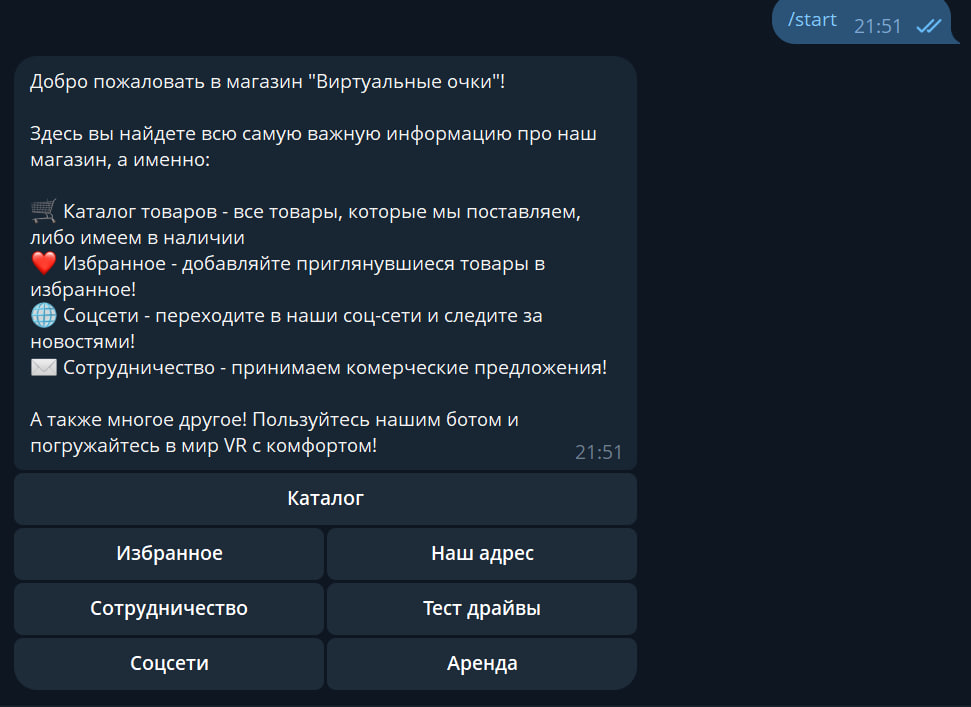
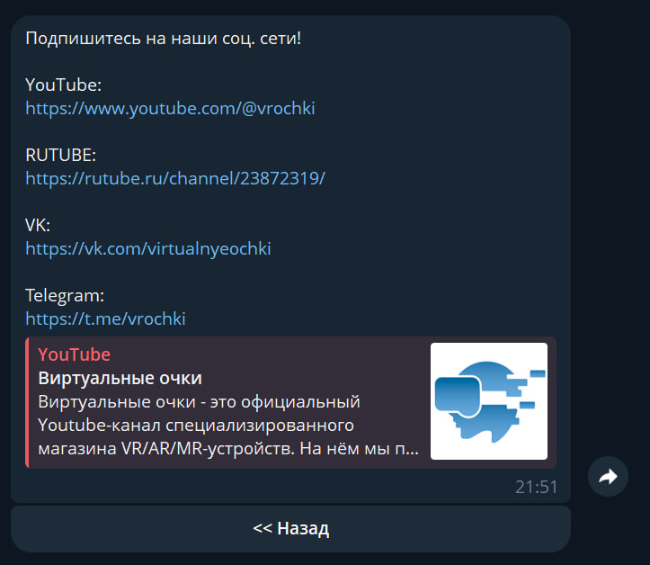
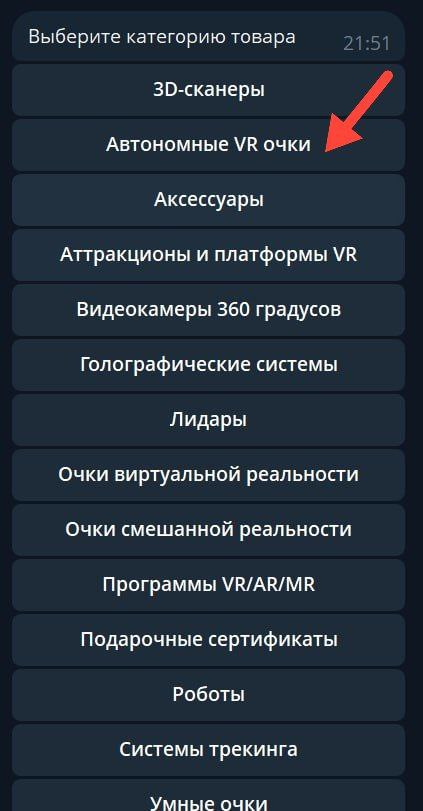
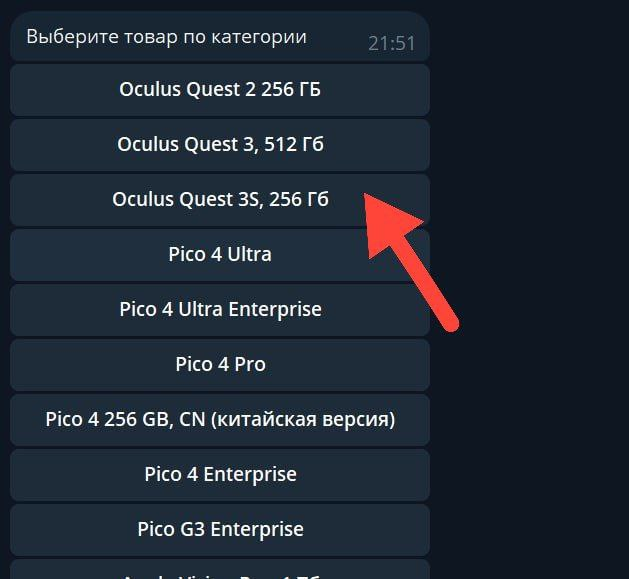
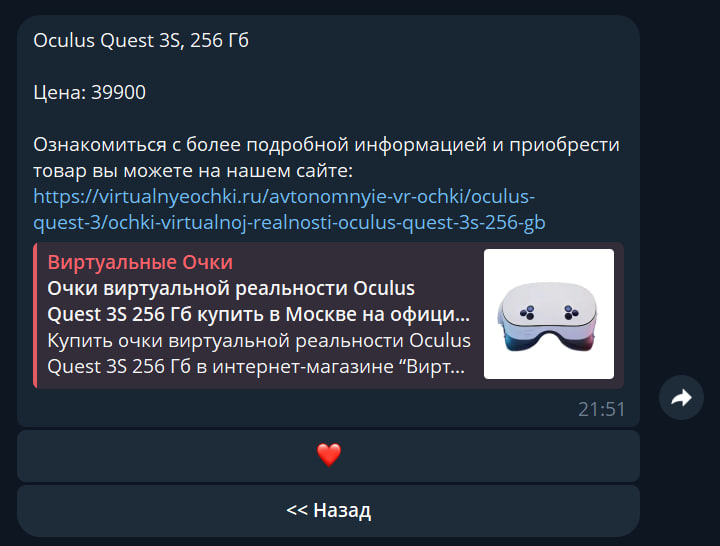
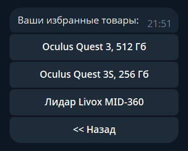
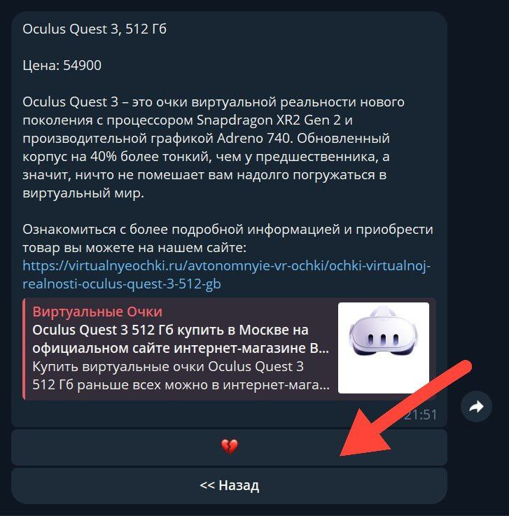

# vr_glasses_bot
В этой сводке я подробнее расскажу не про внутреннюю составляющую бота, а покажу, как он выглядит для обычного пользователя, какие функции предоставляет и для чего создан.

-------

**Для чего создавался бот?**

Бот был создан, чтобы упростить поиск самой важной информации про магазин виртуальных очков, собрав всё в одном месте и добавив удобную навигацию с помощью inline клавиатуры.

---
**Функционал бота.**

В бота добавлен каталог с товарами и функция добавления их в избранное, чтобы было удобнее отслеживать приглянувшиеся устройства.

Также в каждой карточке товара имеется ссылка на официальный сайт магазина, чтобы можно было сразу преобрести устройство, если то сильно заинтересует.

---

**Работа бота на практике**

При запуске бота пользователю сразу высвечивается меню со всеми функциями:

При нажатии например на "Соцсети" пользователю выводится само окно с информацией и inline кнопка "<< Назад"

Такой же принцип работы у кнопок: "Наш адрес", "Сотрудничество" и "Тест драйвы".

При нажатии на кнопку "Каталог" высвечивается список категорий с товарами и, при нажатии какую-либо из них, пользователь видит список товаров в этой категории. 

Например при нажатии на категорию "Автономные VR очки" и на товар "Oculus Quest 3S, 256Гб" пользователь увидит карточку выбранного товара:

Каждый товар можно добавить в избранное нажав "❤️". Избранные товары будут отображаться списком при нажатии на кнопку "Избранное" в главном меню:

Нажав на какой-либо товар в избранных, пользователю высветится карточка этого устройства. Удалить товар из избранного можно одним нажатием на "💔" в его карточке товара. 

---

В дальнейшем скорее всего у этого проекта обновлений не будет. Бот создан в учебных целях.